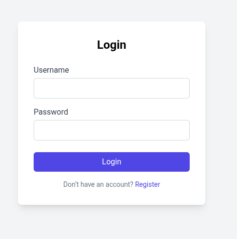
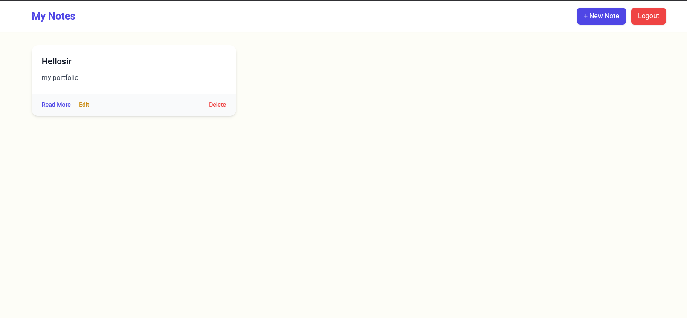
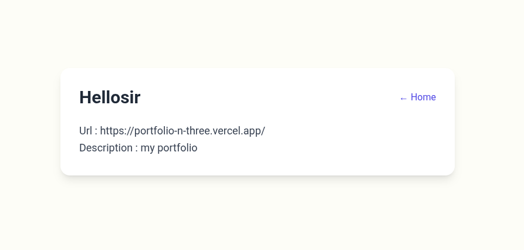
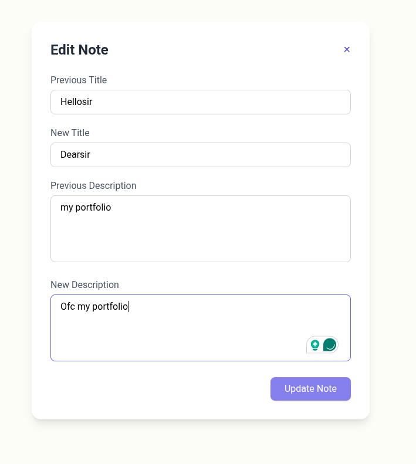

# 📝 Task Management App

A full-featured task management application where users can securely log in, manage personal notes, mark bookmarks, and perform full CRUD operations — all with a clean and modern UI.

---

## 🌟 Features

- 🔐 **Authentication** – JWT-based secure login/register.
- 📋 **CRUD for Notes** – Create, read, update, and delete notes.
- 📎 **Bookmarks** – Add URL bookmarks to notes.
- ❤️ **Favorites** – Mark notes as favorite.
- 👤 **User-specific Data** – Only show notes for the logged-in user.
- 🧾 **Rich UI** – TailwindCSS-powered interface with modals and animations.

---

## 🖼️ Screenshots

| Login | Dashboard (Notes) | Read View | Edit View |
|:-----:|:-----------------:|:---------:|:---------:|
|  |  |  |  |

---

## 🚀 Project Setup

### 🔧 Backend Setup

```bash
# Clone repository
git clone https://github.com/ShubhamNegi4/task-management-app.git
cd task-management-app

# Install backend dependencies
npm install

# Start MongoDB locally or use Atlas
# Create .env file with the following
MONGO_URL=mongodb://localhost:27017/taskapp
JWT_SECRET=your_jwt_secret

# Start the server
npm run dev
